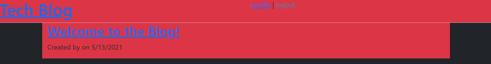

# MVC-Blog

## Description
Tech Blog built using mvc structured coding!

## Table of Contents
- [Description](description)
- [Installation](Installation)
- [Usage](Usage)

## Installation
to install and run locally, clone this repo and then in your terminal, then run `npm i`. After that you can run `npm run seed` if you'd like to add some starting data. Finally to run the app, input `npm start` to start the server and then in an internet browser go to `http://localhost:3001/` to view the site!

## Usage
Once you go to the site, you can check out different posts. Although to make a new post, or add a comment to a post, you have to sign in. You can click the login link at the top of the page, then create an account, or sign-in if you've already created an account. After that you can go to your profile page to view all of your posts, or you can click on Tech Blog name in the top left of the page to go to the homepage and see all posts!

[Live Site](https://quiet-reef-42310.herokuapp.com/)

## Licenses
None

## Contributers
TadhgMc
